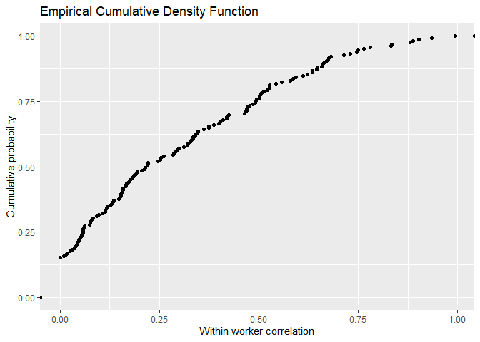

Descriptive analysis of the Kromhout et al 1993 database
================
Jérôme Lavoué
October 15, 2021

The ECDF of the 165 within worker correlation values in Kromhout et al
1993

<!-- -->

    ## [1] "C:/jerome/github/BetweenWorker"
