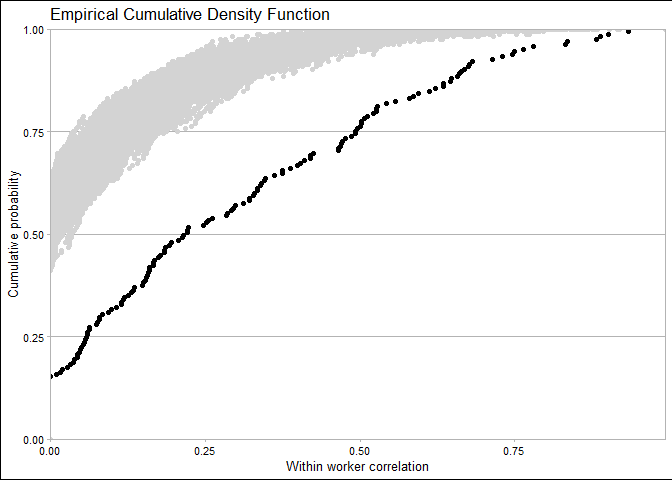

Testing the null hypothesis that the Kromhout et al. observations were
due to chance
================
Jérôme Lavoué
October 19, 2021

For each line in the public [Kromhout et
al’s](https://pubmed.ncbi.nlm.nih.gov/8346874/) table (A1), which had
total n, number of workers(k), and a calculable value of rho, 500 random
samples with the same n and k but rho=0 were generated. So for each rho
observed and reported in A1, I obtained 500 values of rho simulated
under the null hypothesis of rho=0.

I used the calculations presented by
[NVVa/BOHS](https://www.arbeidshygiene.nl/-uploads/files/insite/2011-12-bohs-nvva-sampling-strategy-guidance.pdf)
and taken from several papers by Rappaport/Lyles/Kromhout. One tricky
aspect is that for unbalanced data (most of times, n is not a multiple
of k in the table), the traditional ANOVA formulae have to be adjusted
for the calculation of between worker variance, with the calculation of
a kind of “mean” number of repeats per worker (n0). There are warnings
all over the internet that unbalanced ANOVA is not very good. To be
reassured, I estimated rho using this approach and also using a random
effect model fit through restricted maximum likelihood. The results were
not equal but similar enough for this exercise ; I used the ANOVA
formulae for the main analysis for calculation speed (comparred to the
optimisation used in REML estimation for the random effect model)

Below are the results of this effort : the black ECDF is the observed
rho, the grey part is made from the 500 ECDFs obtained from the
simulation procedure.

<!-- -->
