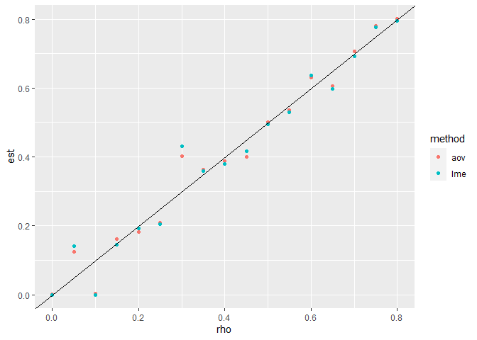

Short validation of the ANOVA procedures
================
Jérôme Lavoué
October 18, 2021

For rho values between 0 and 0.8, one sample was simulated (100 workers
with 1 to 10 repeats). rho was estimated using unbalanced ANOVA or LME

Plot below shows the results

<!-- -->
